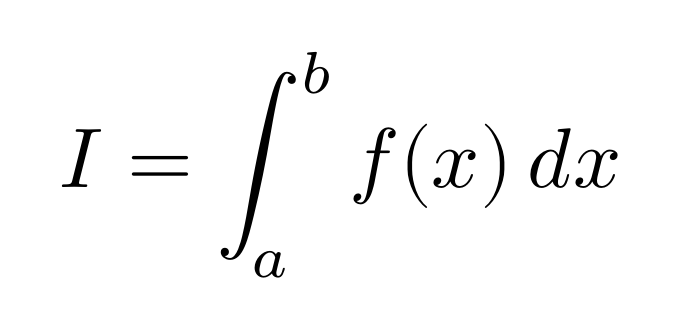
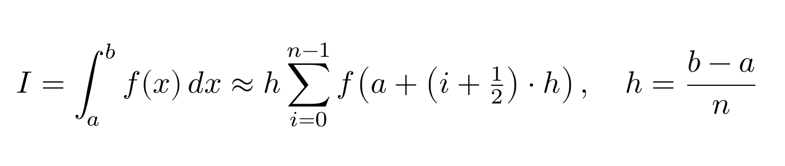

# Интегрирование – метод прямоугольников

- **Студент:** Еремин Василий Егвеньевич, группа 3823Б1ФИ2
- **Технология:** SEQ | MPI
- **Вариант:** №19

## 1. Введение

**Цель работы:** Реализация и сравнительный анализ последовательной и параллельной версий алгоритма численного интегрирования методом прямоугольников.

**Задачи:**
1. Реализовать последовательную версию алгоритма метода прямоугольников
2. Реализовать параллельную версию с использованием технологии MPI
3. Провести сравнительный анализ производительности и эффективности обеих реализаций

## 2. Постановка задачи

**Задача**: Требуется вычислить значение определенного интеграла методом прямоугольников



где:
- `f(x)` — интегрируемая функция
- `a`, `b` — нижний и верхний пределы интегрирования соответственно

**Описание метода решения:** Из трех методов (левых, правых и средних прямоугольников) был выбран *метод средних прямоугольников*.

Область интегрирования разбивается на `n` равных отрезков. Сложная площадь под кривой разбивается на множество простых прямоугольников - на каждом отрезке строится прямоугольник высотой, равной значению функции в середине отрезка. Общая площадь вычисляется как сумма площадей всех этих прямоугольников.

 

**Входные данные:**
- `a` — нижний предел интегрирования (вещественное число)
- `b` — верхний предел интегрирования (вещественное число)  
- `n` — количество отрезков разбиения (целое число)
- `f(x)` — интегрируемая функция

**Выходные данные:**
- Приближенное значение интеграла (вещественное число)

**Ограничения:** 
- `-1 000 000 000 ≤ a < b ≤ 1 000 000 000`
- `0 < n ≤ 100 000 000`


## 3. Описание алгоритма (последовательного)
**Алгоритм последовательного вычисления:**
1. **Найдем шаг интегрирования:** `h = (b - a) / n`
2. **Вычисляем сумму значений функции:** через цикл находим площадь каждого прямоугольника по формуле `f(a + (i + 0.5) * h)` 
3. **Умножаем сумму на шаг:** `result = h * sum`

**Реализация на C++:**

```cpp
double rectangle_method(double a, double b, double n) {
  double result = 0.0;
  double h = (b - a) / n;

  for (int i = 0; i < n; i++) {
    result += f(a + ((i + 0.5) * h));
  }

  result *= h;
  return result;
}
```

## 4. Схема распараллеливания (MPI)
**Алгоритм параллельного вычисления:**
Все тоже самое, но 
1. **Рассылка праметров:** Процесс с рангом 0 получает и рассылает параметры `a`, `b`, `n` всем процессам для правильной синхронизации.
2. **Каждый процесс вычисляет шаг интегрирования:** `h = (b - a) / n`
3. **Локальное вычисление:** Каждый процесс независимо вычисляет свою частичную сумму по формуле `f(a + (i + 0.5) * h)`
4. **Сбор результатов:** Все процессы обмениваются результатами и получают общую сумму
5. **Финальный расчет:** `result = h * sum`

**Принцип разделения отрезков:**

```cpp
for (int i = rank; i < n; i += size) {
    local_result += f(a + ((i + 0.5) * step_size));
  }
```

**Схема распределения вычислений:**
- Процесс 0: обрабатывает отрезки 0, size, 2×size, ...
- Процесс 1: обрабатывает отрезки 1, size+1, 2×size+1, ...
- Процесс k: обрабатывает отрезки k, size+k, 2×size+k, ...

## 5. Детали реализации
**Дополнительные функции в тестах:**
- `InFunction(x)` - подынтегральная функция (что интегрируем)
- `Function(x)` - первообразная (аналитическое решение для проверки)

## 6. Экспериментальная среда
- Hardware/OS: Apple M1 Pro, 6 ядер производительности и 2 эффективности, 16 ГБ, Ubuntu 24.04.2 (DevContainer)
- Toolchain: GCC 13.3.0, C++20, CMake 3.28.3, build type Release
- Environment: PPC_NUM_PROC = 8

## 7. Результаты и обсуждение

### 7.1 Проверка корректности

**Методы верификации корректности:**

1. **Сравнение с аналитическим решением:**
   - Используется функция `Function(x)` - первообразная от `InFunction(x)`
   - Ожидаемый результат вычисляется по формуле Ньютона-Лейбница: `Function(b) - Function(a)`
   - Позволяет получить эталонное значение для сравнения

2. **Автоматизированное тестирование:**
   - Реализованы юнит-тесты для 5 различных тестовых случаев
   - Тестируются разные интервалы и количество разбиений
   - Проверяются как последовательная, так и MPI версии

3. **Допустимая погрешность:**
   ```cpp
   double tolerance = std::max(std::abs(expected_result_) * 0.01, 1e-8);
   ```
    - Относительная погрешность: 1%
    - Абсолютная погрешность: не менее 1e-8
    - Учитывает масштаб ожидаемого результата

**Тестовые случаи:**
 - **Разные интервалы:** [0.0, 1.0], [0.0, 2.0], [-10.0, 100.0], [1.0, 4.0], [-2.0, 3.0]
 - **Разное количество разбиений:** от 1,000 до 100,000
 - **Тестовая функция:** `e^x * (sin(x) + cos(x)) + 3x^2 * cos(x) - x^3 * sin(x)`

**Результат:** Все тесты проходят успешно, что подтверждает корректность обеих реализаций.

### 7.2 Производительность
- **Сложная тестовая функция:** `e^x * (x^2 * sin(x) + 2x * sin(x) + x^2 * cos(x)) + 4x^3 * cos(2x) - 2x^4 * sin(2x)`
- **Количество разбиений** `100 000 000`

**Полученные результаты:**

| **Режим** | **Количество процессов** | **Время, с** | **Speedup** | **Efficiency** |
|-----------|--------------------------|--------------|-------------|----------------|
| SEQ       | 1                        | 2.182        | 1.00        | N/A            |
| MPI       | 2                        | 1.049        | 2.08        | 104%           |
| MPI       | 4                        | 0.566        | 3.92        | 98%            |
| MPI       | 6                        | 0.378        | 5.77        | 96%            |


## 8. Заключение
В рамках данной работы были успешно реализованы последовательная и параллельная версии алгоритма интегрирования методом прямоугольников. Проведенные эксперименты подтвердили значительное ускорение MPI-реализации и корректность работы обоих вариантов алгоритма.

## 9. Источники
1. [Wikipedia](https://ru.wikipedia.org/wiki/Метод_прямоугольников)
2. [Презентация по курсу](https://learning-process.github.io/parallel_programming_slides/slides/01-intro.pdf)

