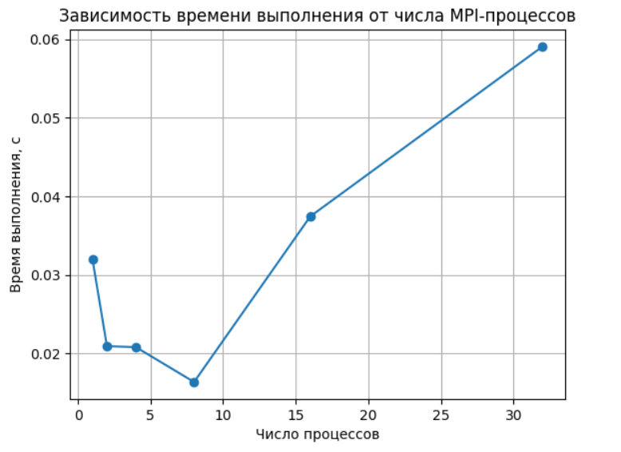
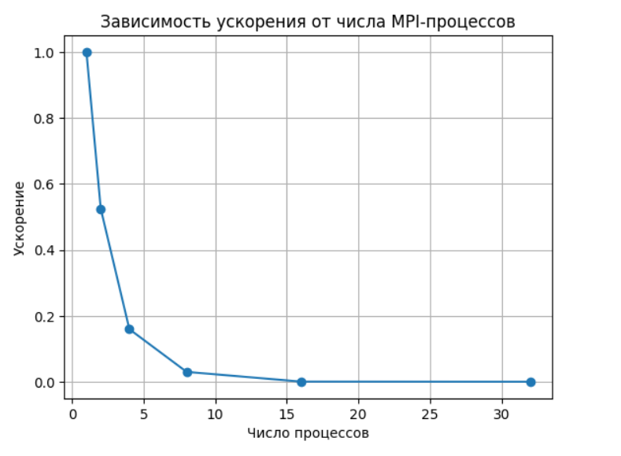
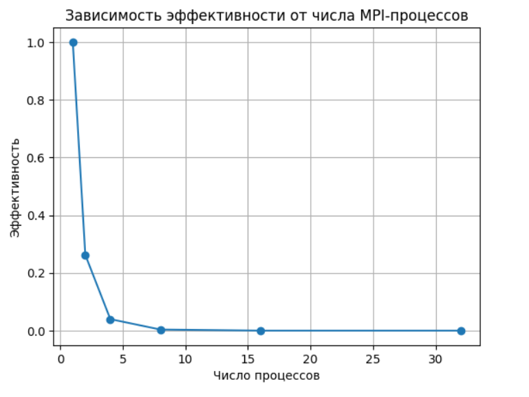

# Передача от всех одному (Reduce)
(последовательная и MPI-реализации)

Студентка: Горячева Ксения Александровна, группа 3823Б1ФИ2
Технологии: SEQ, MPI
Вариант: Reduce (Sum)

---

## 1. Введение

Операция Reduce является одной из базовых коллективных операций в параллельных вычислениях. Её назначение — собрать данные со всех параллельных процессов, применить к ним ассоциативную операцию (в данной работе — суммирование) и передать результат одному процессу (корневому).

Целью данной работы является разработка и исследование операции Reduce для вычисления суммы элементов целочисленного вектора, а также анализ корректности и производительности реализованных алгоритмов.

---

## 2. Постановка задачи

Входные данные:
вектор целых чисел std::vector<int> произвольной длины.

Выходные данные:
вектор длины 1, содержащий сумму всех элементов входного массива.

Для входного вектора v длины n требуется вычислить:
result = sum_{i=0}^{n-1} v[i]

### Ограничения и допущения:

* элементы вектора могут принимать любые значения типа int;
* для пустого вектора результат считается равным 0;
* MPI-реализация должна корректно работать при любом числе процессов.

---

## 3. Базовый алгоритм (Последовательный)

Последовательный алгоритм является тривиальным. Для нахождения суммы всех элементов вектора используется стандартная функция `std::accumulate` из заголовочного файла `<numeric>`. Алгоритм итерируется по всем элементам входного вектора, последовательно прибавляя каждый элемент к внутреннему аккумулятору. Начальное значение аккумулятора равно нулю. 

Временная сложность такого алгоритма составляет O(N), где N — количество элементов в векторе.

## 4. Параллельная реализация (MPI)

Cемантика операции Reduce: все процессы участвуют в вычислении, итоговая сумма формируется на процессе с рангом 0 и затем рассылается всем процессам.

### 4.1 Распределение данных

Пусть:
n — размер входного вектора;
p — число MPI-процессов.

Размер локального блока для процесса с рангом rank вычисляется следующим образом:
base = n / p rem = n % p local_size = base + (rank < rem ? 1 : 0) 

Процесс с рангом 0 формирует массивы sendcounts и displs, после чего используется коллективная операция:
MPI_Scatterv(...) 

Это позволяет корректно распределить данные даже при n % p ≠ 0.

---

### 4.2 Локальные вычисления

Каждый процесс вычисляет сумму элементов своего локального блока:
int local_sum = std::accumulate(local_input_.begin(), local_input_.end(), 0); 

---

### 4.3 Сбор глобального результата (Reduce)

Сбор локальных сумм реализован вручную с использованием точечных операций:

процессы с rank ≠ 0 отправляют свои local_sum на процесс 0 через MPI_Send;
процесс 0 принимает все значения с помощью MPI_Recv и аккумулирует итоговую сумму.

if (rank == 0) { 
    global_sum = local_sum; 
    for (int i = 1; i < size; ++i) { 
        MPI_Recv(&tmp, 1, MPI_INT, i, 0, MPI_COMM_WORLD, MPI_STATUS_IGNORE); 
        global_sum += tmp; 
    } 
} else { 
    MPI_Send(&local_sum, 1, MPI_INT, 0, 0, MPI_COMM_WORLD);
} 

После этого итоговое значение рассылается всем процессам с помощью MPI_Bcast.

---

## 5. Тестирование корректности

Для проверки корректности разработан набор функциональных тестов, загружаемых из tests.json.

Тесты включают:
* небольшой вектор;
* вектор из одного элемента;
* отрицательные значения;
* пустой вектор;
* вектор, заполненный единицами.

Всего выполнено 10 функциональных тестов (по 5 тест-кейсов для SEQ и MPI реализаций).

Все тесты успешно пройдены, что подтверждает корректность реализации.

---

## 6. Экспериментальное исследование производительности

Замеры производительности выполнялись с использованием performance-тестов фреймворка PPC.

Параметры эксперимента:

* входные данные: {10'000'000, 1}
* режимы измерений:
* pipeline
* task_run
* количество MPI-процессов: 2, 4, 8, 16, 32

### 6.1 Результаты измерений (task_run, MPI)

Замеры производительности проводились для MPI-реализации на 1, 2, 3, 4, 8 и 16 процессах. За основу для расчетов (`task_run`) взято время выполнения на 1 процессе.

| Число процессов (P) | Время (сек) | Ускорение (S) | Эффективность (E)    |
|---------------------|-------------|---------------|----------------------|
|          1          |  0.00000400 |     1.00      |        1.00          |
|          2          |  0.00000762 |     0.52      |        0.26          |
|          4          |  0.00002508 |     0.16      |        0.04          |
|          8          |  0.00013296 |     0.03      |        0.004         |
|          16         |  0.00654368 |     0.0006    |        0.00004       |
|          32         |  0.01556248 |     0.0003    |        0.000008      |

Графики производительности

*Рис. 1. Зависимость времени выполнения от числа MPI-процессов.*

*Рис. 2. Зависимость ускорения от числа MPI-процессов.*

*Рис. 3. Зависимость эффективности от числа MPI-процессов.*

---

## 7. Анализ результатов

Результаты показывают, что для данной задачи MPI-реализация не демонстрирует ускорения при увеличении числа процессов.

Основные причины:
* операция суммирования является вычислительно очень простой;
* объём полезных вычислений на процесс резко уменьшается с ростом p;
* накладные расходы на:
    MPI_Scatterv,
    MPI_Send / MPI_Recv,
    MPI_Bcast
начинают доминировать над временем локальных вычислений.

С увеличением числа процессов время выполнения возрастает, что является наглядной иллюстрацией закона Амдала.

---

## 8. Заключение

В ходе выполнения работы были реализованы и исследованы последовательная и параллельная версии операции Reduce для вычисления суммы элементов вектора.

Основные выводы:
* обе реализации корректны и успешно проходят функциональные тесты;
* MPI-версия корректно обрабатывает любые размеры входных данных;
* рост числа процессов приводит к увеличению времени выполнения из-за коммуникационных накладных расходов.

---

## 9. Используемые источники

1.  Parallel Programming Course - [https://learning-process.github.io/parallel_programming_course/ru/](https://learning-process.github.io/parallel_programming_course/ru/)
2.  Parallel Programming 2025-2026 Video-Records - [https://disk.yandex.ru/d/NvHFyhOJCQU65w](https://disk.yandex.ru/d/NvHFyhOJCQU65w)
3.  Open MPI: Documentation — [https://www.open-mpi.org/doc/](https://www.open-mpi.org/doc/)
4.  std::accumulate documentation - [https://en.cppreference.com/w/cpp/algorithm/accumulate](https://en.cppreference.com/w/cpp/algorithm/accumulate)
5.  MPI_Reduce documentation - [https://www.open-mpi.org/doc/v4.1/man3/MPI_Reduce.3.php](https://www.open-mpi.org/doc/v4.1/man3/MPI_Reduce.3.php)

---