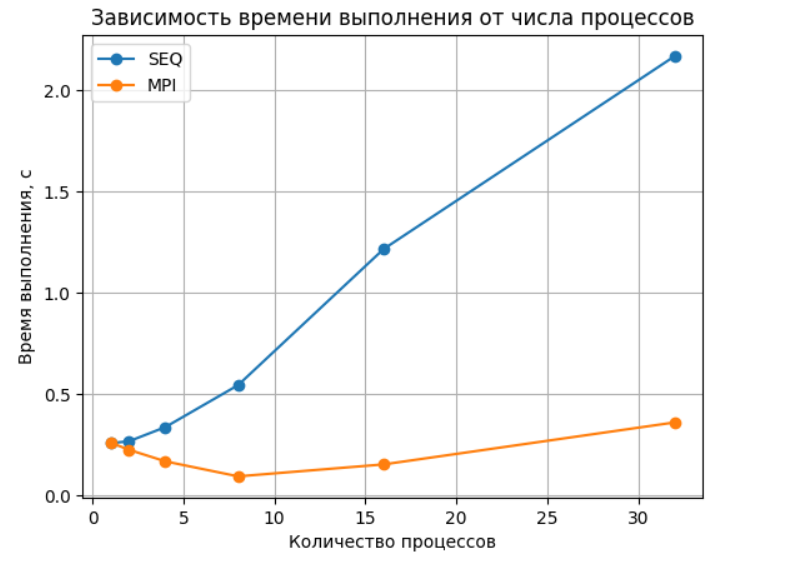
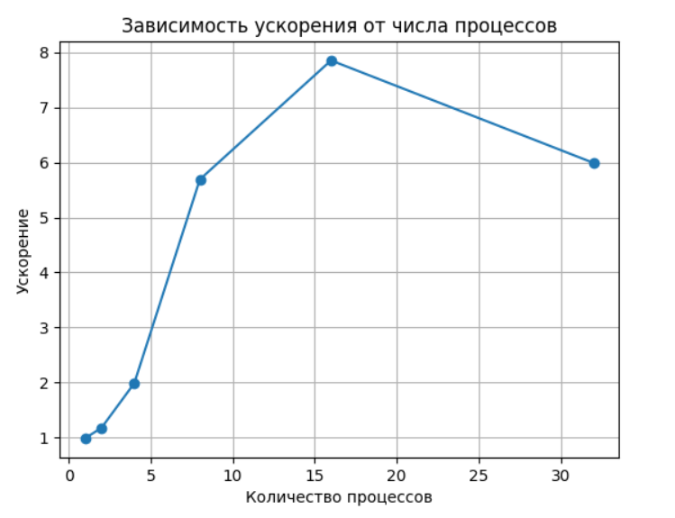
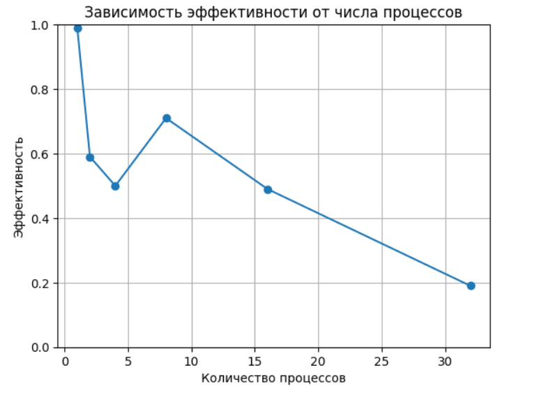

# Умножение плотных матриц. Элементы типа double. Алгоритм Штрассена.
(последовательная и MPI-реализации, алгоритм Штрассена)

Студентка: Горячева Ксения Александровна, группа 3823Б1ФИ2
Технологии: SEQ, MPI
Вариант: №3

---

## 1. Введение
Задача умножения матриц является одной из базовых и наиболее часто встречающихся задач линейной алгебры и численных методов. Она широко применяется в научных вычислениях, компьютерной графике, машинном обучении и обработке сигналов.

Классический алгоритм умножения квадратных матриц имеет вычислительную сложность
O(n³), что делает его неэффективным для матриц большого размера. Одним из способов оптимизации является использование алгоритма Штрассена, который уменьшает асимптотическую сложность до O(n^{log₂7}) ≈ O(n^{2.81}) за счёт сокращения количества умножений.

Целью данной работы является реализация и исследование последовательной и параллельной (MPI) версий алгоритма Штрассена для умножения плотных квадратных матриц с элементами типа double.

---

## 2. Постановка задачи

Входные данные: 
Две квадратные матрицы A и B размера n × n, элементы типа double.

Выходные данные:
Матрица C = A × B размера n × n.

Ограничения и допущения:
* матрицы являются квадратными и одинакового размера;
* размер матриц может не быть степенью двойки;
* элементы матриц имеют тип double;
* результаты SEQ и MPI реализаций должны совпадать с точностью 1e-6.

---

## 3. Последовательная реализация (SEQ)

### 3.1 Общая идея

Последовательная версия основана на рекурсивной реализации алгоритма Штрассена.
Если размер матрицы превышает заданный порог (threshold = 128), матрица разбивается на 4 подматрицы, после чего вычисляются 7 вспомогательных матриц вместо 8, как в классическом блочном алгоритме.
Для малых размеров используется наивное умножение, так как оно эффективнее из-за меньших накладных расходов.

---

### 3.2 Дополнение матриц

Алгоритм Штрассена требует, чтобы размер матрицы был степенью двойки.
Если это не так, матрицы дополняются нулями до ближайшей степени двойки:
m = next_power_of_two(n) 
После вычислений результат обрезается до исходного размера.

---

### 3.3 Наивное умножение

При достижении порога рекурсии используется стандартный алгоритм:
for i 
    for k 
        for j 
            C[i][j] += A[i][k] * B[k][j] 

---

### 3.4 Сложность

* по времени:
    * асимптотически — O(n^{log₂7})
    * для малых n — O(n³)
* по памяти:
    * O(n²) с учётом временных подматриц

---

## 4. Параллельная реализация (MPI)

### 4.1 Общая схема

MPI-реализация использует параллелизм верхнего уровня алгоритма Штрассена.
Семь независимых произведений (M₁ … M₇) распределяются между MPI-процессами.
Если количество процессов меньше 7, оставшиеся произведения вычисляются на процессе с рангом 0.

---

### 4.2 Разбиение вычислений

Для матриц размера n × n:
* матрицы A и B разбиваются на подматрицы A₁₁, A₁₂, A₂₁, A₂₂ и аналогично для B;
* каждому процессу назначается вычисление одного из Mi;
* используется MPI_Comm_split для формирования подкоммуникаторов.

---

### 4.3 Обмен данными

* локальные результаты Mi сериализуются в одномерный буфер (flatten);
* передаются на процесс 0 с помощью MPI_Send;
* процесс 0 собирает все Mi и формирует итоговую матрицу C;
* результат рассылается всем процессам через MPI_Bcast.

---

### 4.4 Особенности реализации

* параллелизация выполняется только на верхнем уровне рекурсии;
* дальнейшие рекурсивные вызовы выполняются локально;
* при числе процессов > 7 избыточные процессы не участвуют в вычислениях.

---

### 4.5 Сложность

* вычислительная сложность — как у SEQ версии;
* ускорение достигается за счёт параллельного вычисления независимых Mi;
* накладные расходы связаны с:
    * созданием подкоммуникаторов;
    * передачей данных;
    * синхронизацией процессов.

---

## 5. Тестирование корректности

Для проверки корректности был реализован набор функциональных тестов, включающий:
* матрицы размеров от 1×1 до 5×5;
* единичные матрицы;
* нулевые матрицы;
* матрицы с отрицательными элементами;
* дробные значения;
* повторяющиеся элементы;
* матрицы, размер которых не является степенью двойки.

Всего выполнено 32 функциональных теста, каждый из которых запускался:
* для SEQ версии;
* для MPI версии.

Все тесты успешно пройдены.

--- 

## 6. Экспериментальное исследование производительности

Измерения проводились на матрицах размера 256 × 256.

| Число процессов (P) |Время SEQ (сек)  |Время MPI (сек) | Ускорение (S) | Эффективность (E) |
|---------------------|-----------------|----------------|---------------|-------------------|
| 1                   | 0.260           | 0.262          | 0.99          | 0.99              |
| 2                   | 0.269           | 0.227          | 1.18          | 0.59              |
| 4                   | 0.339           | 0.170          | 1.99          | 0.50              |
| 8                   | 0.546           | 0.096          | 5.69          | 0.71              |
| 16                  | 1.217           | 0.155          | 7.85          | 0.49              |
| 32                  | 2.168           | 0.362          | 5.99          | 0.19              |

Графики производительности

*Рис. 1. Зависимость времени выполнения от числа процессов.*

*Рис. 2. Зависимость ускорения от числа процессов.*

*Рис. 3. Зависимость эффективности от числа процессов.*

---

## 7. Анализ результатов

При 1 процессе ускорение близко к 1, что подтверждает корректность измерений.
Максимальное ускорение достигается при 16 процессах (≈ 7.85), однако эффективность при этом уже снижается.
Наилучшая эффективность наблюдается при 8 процессах (≈ 0.71), что соответствует числу независимых подзадач алгоритма Штрассена.
При дальнейшем увеличении числа процессов эффективность резко падает из-за накладных расходов MPI и недоиспользования процессов.

---

## 8. Выводы

В ходе работы были реализованы и исследованы последовательная и параллельная версии алгоритма Штрассена для умножения плотных матриц.

Основные выводы:
* алгоритм Штрассена корректно работает для матриц произвольного размера;
* MPI-реализация демонстрирует значительное ускорение по сравнению с SEQ;
* наилучшая эффективность достигается при количестве процессов, близком к числу независимых подзадач (7);
* при большом числе процессов накладные расходы начинают доминировать.

Разработанная реализация подтверждает эффективность комбинирования алгоритмической оптимизации (Штрассен) и параллельных вычислений (MPI) для задач линейной алгебры.

---

## 9. Используемые источники

1.  Parallel Programming Course - [https://learning-process.github.io/parallel_programming_course/ru/](https://learning-process.github.io/parallel_programming_course/ru/)
2.  Parallel Programming 2025-2026 Video-Records - [https://disk.yandex.ru/d/NvHFyhOJCQU65w](https://disk.yandex.ru/d/NvHFyhOJCQU65w)
3.  Open MPI: Documentation — [https://www.open-mpi.org/doc/](https://www.open-mpi.org/doc/)
4. Matrix Multiplication - [https://www.geeksforgeeks.org/dsa/strassens-matrix-multiplication/](https://www.geeksforgeeks.org/dsa/strassens-matrix-multiplication/)
5. Александр Охотин. Математические основы алгоритмов, осень 2025 г. Лекция 5. Структуры данных в алгоритме Дейкстры. Пути между всеми парами вершин в графе: алгоритм Варшалла. Пути между всеми парами вершин в графе с весами: алгоритм Флойда–Варшалла. Достижимость в графе и умножение матриц. Алгоритм Штрассена быстрого умножения матриц - [https://users.math-cs.spbu.ru/~okhotin/teaching/algorithms1_2025/okhotin_algorithms1_2025_l5.pdf](https://users.math-cs.spbu.ru/~okhotin/teaching/algorithms1_2025/okhotin_algorithms1_2025_l5.pdf)

---
