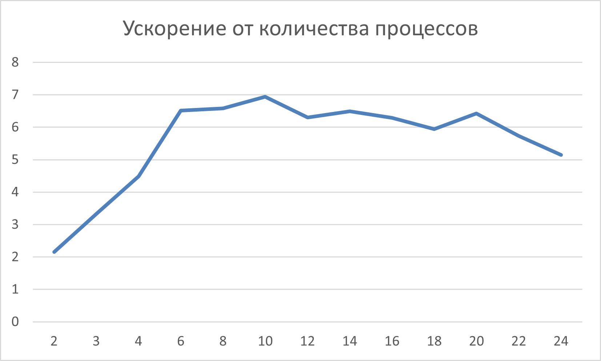
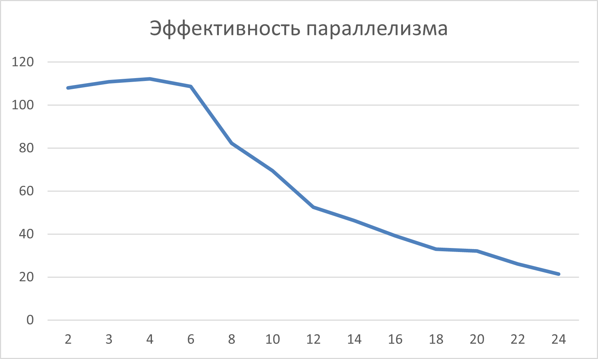

# Ленточная горизонтальная схема А, вертикальное В - умножение матрицы на матрицу

- Студент: Гутянский Алексей Сергеевич, группа 3823Б1ФИ3
- Технология: SEQ | MPI
- Вариант: 14

## 1. Введение

Умножение матриц является одной из базовых операций линейной алгебры и широко используется в задачах численного моделирования, машинного обучения, компьютерной графики и обработки сигналов. При увеличении размеров матриц вычислительная сложность операции растёт кубически, что делает последовательную реализацию неэффективной для крупных входных данных.

В работе рассматривается реализация алгоритма умножения матриц с использованием ленточной схемы распределения данных и анализ возможностей его параллельного исполнения с применением технологии MPI.

## 2. Постановка задачи

Даны две матрицы:
- матрица \(A\) размера \(n \times k\),
- матрица \(B\) размера \(k \times m\),
содержащие целые числа.

Требуется вычислить матрицу \(С = A \times B\) размера \(n \times m\).

**Входные данные:** размеры матриц \(n\), \(k\), \(m\), а также элементы матриц \(A\) и \(B\). Гарантируется, что элементы входных матриц и результирующей матрицы помещаются в 32-битный знаковый целочисленный тип.

**Выходные данные:** Матрица \(С = A \times B\) размера \(n \times m\).

## 3. Базовый алгоритм (Последовательный)

Последовательный алгоритм перемножения матриц реализован с использованием 3 вложенных друг в друга циклов:

```cpp

for (size_t i = 0; i < C_rows; i++) {
    for (size_t j = 0; j < C_cols; j++) {
        for (size_t k = 0; k < A_cols; k++) {
            C[(i * C_cols) + j] += A[(i * A_cols) + k] * B[(k * B_cols) + j];
        }
    }
}
```

Для каждой строки матрицы \(A\) и каждого столбца матрицы \(B\) вычисляется скалярное произведение. Реализация имеет последовательный доступ к памяти по строкам матрицы \(A\), однако доступ к элементам матрицы \(B\) происходит с константным шагом, что не очень хорошо с точки зрения кэширования.

## 4. Параллелизация

### 4.1. Схема разбиения данных

В параллельной версии используется ленточная схема:

- матрица \(A\) разделяется по строкам между процессами;
- матрица \(B\) разделяется между процессами по столбцам.

Каждому процессу в соответствии с его рангом передается непрерывный блок столбцов первой матрицы и непрерывный блок столбцов второй матрицы. Размеры блоков вычисляются так, чтобы разница в количестве строк (столбцов) между двумя процессами не превышала 1. Таким образом, нагрузка между процессами распределяется равномерно.

### 4.2. Обмен данными

Входные данные полностью загружаются процессом, имеющим нулевой ранг, затем рассылаются в соответствии со схемой, описанной выше.

Каждый процесс получает:

- размеры входных матриц;
- блок строк матрицы \(A\);
- блок столбцов матрицы \(B\).

Для рассылки размеров используется _MPI_Bcast_. Для рассылки элементов матриц используется _MPI_Scatterv_.

Перед рассылкой матрица \(B\) перепаковывается таким образом, чтобы блоки столбцов представляли собой непрерывные участки памяти.

### 4.3. Вычисление и ротация блоков

Результатом работы каждого процесса должен стать соответсвующий ему непрерывный блок строк матрицы \(C\). Имея блок строк матрицы \(A\) и блок столбцов матрицы \(B\) процесс не может вычислить результат целиком.

Вычисление результата происходит поэтано. На каждом этапе:

- Процесс использует свой блок столбцов матрицы \(B\) для вычисления части результата.
- Процесс передает блок столбцов матрицы \(B\) следующему процессу (в порядке ранга).
- Процесс принимает блок столбцов матрицы \(B\) от предыдущего процесс (также в порядке ранга).

Блоки столбцов передаются циклически - процесс с рангом 0 получает данные от процесса с рангом \(world\_size - 1\).

Ротация столбцов выполняется с использованием функции _MPI_Sendrecv_.

### 4.4. Сбор данных

Так как каждый процесс вычисляет непрерывный блок строк матрицы \(C\), полная матрица без применения дополнительных преобразований собирается на нулевом процессе с использованием функции _MPI_Gatherv_.

## 5. Детали реализации

Для функциональных тестов используется загрузка входных данных из текстовых файлов, расположенных в директории data/. Для тестирования корректности применяются матрицы малого размера с различными значениями элементов.

Для измерения производительности используются две квадратные матрицы размера \(1000 \times 1000\). Матрицы сгенерированы следующим образом:
\(a_{ij} = i\), \(b_{ij} = j\).
Такое заполнение матриц позволяет проверять корректность вычисления без использования алгоритма перемножения матриц.

Загрузка входных данных и проверка результата выполняются только процессом с нулевым рангом.

## 6. Тестовое окружение

- Аппаратное обеспечение/Операционная система: Intel Core i5 14600KF, 6P+8E ядер, 64Gb Ddr5 5600Mhz, Windows 10, MS-MPI.
- Инструменты сборки: Cmake 4.2.0-rc4, Visual Studio 2022, MSVC, x64 Release.
- Переменные окружения: PPC_NUM_THREADS=PPC_NUM_PROC=1/2/3/4/6/8/10/12/14/16/18/20/22/24, PPC_PERF_MAX_TIME=10000.
- Данные: вручную созданные функциональные тесты небольшого размера, автоматически генерируемые матрицы \(1000 \times 1000\) для тестов производительности.
- Дополнительно: в scripts/run_tests.py были отключены perf тесты для всех технологий, кроме seq и mpi.

## 7. Результаты

### 7.1 Корректность

Последовательная и параллельная версии программы были протестированы в различных ситуациях:

- матрицы размером \(1 \times 1\);
- неквадратные матрицы;
- матрицы с нулевыми элементами;
- одна из матриц единичная;
- случайно сгенерированные данные (имитация реальных данных).

Во всех случаях результаты работы алгоритмов полностью совпадали с ожидаемыми.

### 7.2 Производительность

Поскольку последовательная и MPI-версии, хотя и имеют схожую концепцию, реализованы по-разному и по-разному оптимизируются компилятором, MPI версия при запуске на одном процессе работает быстрее. Поэтому для оценки ускорения и эффективности в качестве базового времени используется запуск MPI-версии на одном процессе.

| Режим        | Кол-во процессов | Время, сек | Ускорение | Эффективность параллелизма |
|-------------|-------|---------|---------|------------|
| seq         | 1     | 1.240  | N/A    | N/A        |
| mpi         | 1     | 0.511  | 1   | N/A      |
| mpi         | 2     | 0.236  | 2.15   | 107.9%      |
| mpi         | 3     | 0.153  | 3.32   | 110.9%      |
| mpi         | 4     | 0.113  | 4.48   | 112.1%      |
| mpi         | 6     | 0.078  | 6.51   | 108.6%      |
| mpi         | 8     | 0.076  | 6.58   | 82.2%      |
| mpi         | 10     | 0.073  | 6.94   | 69.4%      |
| mpi         | 12     | 0.081  | 6.29   | 52.5%      |
| mpi         | 14     | 0.078  | 6.48   | 46.3%       |
| mpi         | 16    | 0.081  | 6.28    | 39.3%       |
| mpi         | 18    | 0.085  | 5.94    | 33.0%       |
| mpi         | 20    | 0.079  | 6.42    | 32.1%       |
| mpi         | 22    | 0.089  | 5.72    | 26.0%       |
| mpi         | 24    | 0.099  | 5.14    | 21.4%       |




До 6 процессов наблюдается сверхлинейное ускорение, что может быть связано с улучшением локальности доступа к памяти: уменьшаются размеры обрабатываемых блоков, снижая число кэш-промахов.

При дальнейшем увеличении числа процессов эффективность параллелизма снижается, поскольку объём вычислений на процесс становится сопоставим или меньше накладных расходов на обмен данными.

Несмотря на это, максимальное ускорение достигается при использовании 10 процессов.

## 8. Заключение

В рамках работы была реализована программа умножения матриц с использованием ленточной схемы распределения данных и технологии MPI. Было показано, что корректная организация обменов позволяет каждому процессу вычислить независимый блок строк результирующей матрицы.

Экспериментальные результаты демонстрируют, что эффективность параллелизации ограничивается коммуникационными затратами, особенно при большом числе процессов. Тем не менее, реализованный подход наглядно иллюстрирует принципы распределения данных и вычислений в задачах линейной алгебры.

## 9. Источники

1. Microsoft MPI : документация [Электронный ресурс] // Microsoft Learn. – URL: https://learn.microsoft.com/ru-ru/message-passing-interface/microsoft-mpi (дата обращения: 18.11.2025).
2. Курс лекций "Параллельная обработка данных" : Лаборатория Параллельных Информационных Технологий, НИВЦ МГУ [Электронный ресурс] // PARALLEL.RU. - URL: https://parallel.ru/vvv/mpi.html (дата обращения: 03.11.2025)
3. Сысоев А. В. Курс лекций по параллельному программированию.
4. Algorithms for parallel matrix multiplication [Электронный ресурс] // Southern Federal University. — URL: https://edu.mmcs.sfedu.ru/pluginfile.php/157505/mod_resource/content/1/MPIMatr2021-en.pdf (дата обращения: 24.12.2025)