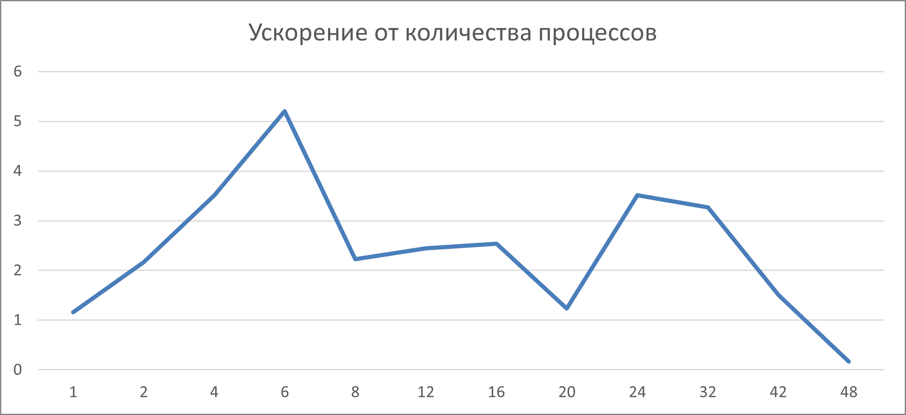
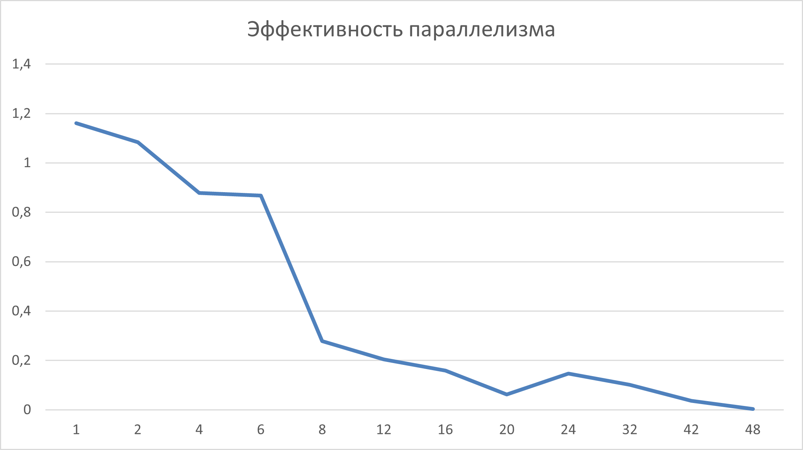

# Сумма значений по столбцам матрицы

- Студент: Гутянский Алексей Сергеевич, группа 3823Б1ФИ3
- Технология: SEQ | MPI
- Вариант: 12

## 1. Введение

Суммирование элементов матрицы по столбцам относится к числу базовых операций, которые часто становятся частью более сложных вычислительных цепочек: статистической обработки данных, численных методов, разложения больших наборов измерений. Несмотря на простоту формулировки, практическая реализация такой операции для крупных матриц требует продуманной организации данных и эффективного распределения нагрузки между вычислительными узлами.

Работа посвящена разработке решения для суммирования матрицы по столбцам, а также анализу возможностей его параллельного исполнения. Рассматриваются ключевые аспекты реализации, потенциальные источники узких мест и факторы, влияющие на производительность при различных способах разбиения данных.

## 2. Постановка задачи

Дана прямоугольная матрица \(A\) размера \(n \times m\), содержащая целые числа. Для каждого столбца требуется вычислить сумму элементов в нём.

**Входные данные:** два целых числа \(n\) и \(m\), задающих соответственно кол-во строк и столбцов матрицы, \(n \times m\) чисел задающих элементы матрицы. Гарантируется, что элементы матрицы и ответ помещаются в 64-битный знаковый тип.

**Выходные данные:** \(m\) целых чисел - сумм по каждому из столбцов матрицы.

## 3. Базовый алгоритм (Последовательный)

Будем рассматривать решение как массив длины \(m\). Изначально все его элементы инициализированы нулями.

```cpp
std::fill(GetOutput().begin(), GetOutput().end(), 0);

for (size_t i = 0; i < GetInput().rows; i++) {
    for (size_t j = 0; j < GetInput().cols; j++) {
        GetOutput()[j] += GetInput().data[(i * GetInput().cols) + j];
    }
}
```

Для каждой строки матрицы от \(1\) до \(n\) столбцы обходятся в порядке от \(1\) до \(m\). Ответ накапливается в соответствующих ячейках массива.

При описанной схеме обхода достигается почти линейный доступ к памяти. Обход строки может быть векторизован компилятором для достижения больше производительности.

## 4. Параллелизация

У каждого процесса есть своя копия входных данных. Взаимодействия при загрузке данных нет.

Каждый процесс обрабатывает одну или более последовательных строк матрицы. Количество строк вычисляется по формуле:

```cpp
int remainder = n % proc_count;
int rows = floor(n / proc_count) + (rank < remainder ? 1 : 0);
```

В формуле ранг MPI процесса обозначен как _rank_, а общее количество процессов как _proc_count_.

Реализация суммирования для выбранных строк повторяет реализацию последовательного алгоритма за исключением номеров обходимых строк.

Общее решение вычисляется с использованием функции _MPI_Allreduce_. Ответ становится доступен в каждом из процессов (необходимость, диктуемая тестируещим фреймворком).

## 5. Детали реализации

gutyansky_a_matrix_column_sum/
├── common/include/common.hpp
├── seq/include/ops_seq.hpp
├── seq/src/ops_seq.cpp
├── mpi/include/ops_mpi.hpp
├── mpi/src/ops_mpi.cpp
├── tests/functional/main.cpp
├── tests/performance/main.cpp
└── data/

Для функциональных тестов (tests/functional/main.cpp) реализована загрузка из файлов, хранящихся в директории data/. Матрица большого размера, сохраненная в текстовом файле, может занимать большой объем места на диске, но для функциональных тестов возможность использования больших матриц является избыточной.

Для теста производительности используется квадратная матрица размера 8000 на 8000 элементов. Матрица состоит из единиц, что никак не влияет на скорость исполнения, но упрощает реализацию теста.

Количество используемой памяти никак не оптимизировалось. Из-за особенностей работы тестирующего фреймворка две полных копии данных хранится в каждом запущенном процесса. Тест производительности, описанный в предыдущем абзаце, потребляет около 1Гб ОЗУ.

## 6. Тестовое окружение

- Аппаратное обеспечение/Операционная система: Intel Core i5 14600KF, 6P+8E ядер/20 потоков, 64Gb Ddr5 5600Mhz, Windows 10.
- Инструменты сборки: Cmake 4.2.0-rc4, Visual Studio 2022, MSVC, x64 Release.
- Переменные окружения: PPC_NUM_THREADS=PPC_NUM_PROC=1/2/4/6/8/12/16/20/24/32/42/48, PPC_PERF_MAX_TIME=10000.
- Данные: вручную созданные тесты небольшого размера, случайным образом сгенерированный тест 1000x1000 элементов, матрица из единиц размера 8000x8000.
- Дополнительно: в scripts/run_tests.py были отключены perf тесты для всех технологий, кроме seq и mpi.

## 7. Результаты

### 7.1 Корректность

Решение, как в последовательной, так и в параллельной версии было протестировано на входных данных разного размера и содержания. В числе тестов: матрица с одним столбцом и одной строкой, матрица, состоящая из нулей, неквадратная матрица и другие.

Скорость исполнения проверена на матрице из единиц размера 8000х8000 элементов. Время исполнения стабильно и равно 35мс.

### 7.2 Производительность

Время, ускорение, эффективность:

| Режим        | Кол-во процессов | Время, сек | Ускорение | Эффективность параллелизма |
|-------------|-------|---------|---------|------------|
| seq         | 1     | 0.035  | 1.00    | N/A        |
| omp         | 2     | 0.016  | 2.17    | 108.4%     |
| omp         | 4     | 0.010  | 3.51    | 87.5%      |
| omp         | 6     | 0.007  | 5.20    | 86.7%      |
| omp         | 8     | 0.016  | 2.22    | 27.8%      |
| omp         | 12    | 0.029  | 2.44    | 20.3%      |
| omp         | 16    | 0.014  | 2.53    | 15.8%      |
| omp         | 20    | 0.029  | 1.50    | 3.5%       |
| omp         | 24    | 0.010  | 3.51    | 14.6%      |
| omp         | 32    | 0.012  | 3.26    | 10.2%      |
| omp         | 42    | 0.023  | 1.5     | 3.6%       |
| omp         | 48    | 0.221  | 0.16    | 0.3%       |




Для двух потоков эффективность больше 100%, поскольку код для MPI версии был оптимизирован компилятором лучше, чем для последовательной.

Эффективность параллелизма падает вместе с увеличением числа обменов между процессами.

Необычным образом ведет себя график ускорения. До 6 процессов идет почти линейный рост ускорения. Это совпадает с количеством производительных ядер процессора, а также с интуитивными представлениями о пропускной способности оперативной памяти.

Далее производительность стремительно падает до достижения 20 процессов. Причин у этого может быть несколько, начиная от использования логических потоков и энергоэффективных ядер, заканчивая борьбой за доступ к памяти. Последний вариант выглядит правдоподобным, исходя из описанных ранее проблем с потреблением памяти процессами.

Небольшое ускорение видно на 24 процессах. _Предположение автора отчета: здесь появляется конкуренция за процессорное время, что приводит к частым переключениям контекста. За счет переключений немного уменьшается конкуренция за доступ к ОЗУ, что может давать прирост._

К 42 процессам ускорение снова уменьшается и переходит в замедление на 48 процессах, т.к. операционная система начала использовать _swap_ и копировать страницы на диск.

## 8. Заключение

Была разработана программа, решающая задачу суммирования матрицы по столбцам и проанализированы возможности её параллелизации с использованием MPI. Были найдены и описаны узкие места и возможные причины их возникновения.

## 9. Источники

1. Microsoft MPI : документация [Электронный ресурс] // Microsoft Learn. – URL: https://learn.microsoft.com/ru-ru/message-passing-interface/microsoft-mpi (дата обращения: 18.11.2025).
2. Курс лекций "Параллельная обработка данных" : Лаборатория Параллельных Информационных Технологий, НИВЦ МГУ [Электронный ресурс] // PARALLEL.RU. - URL: https://parallel.ru/vvv/mpi.html (дата обращения: 03.11.2025)
3. Сысоев А. В. Курс лекций по параллельному программированию.