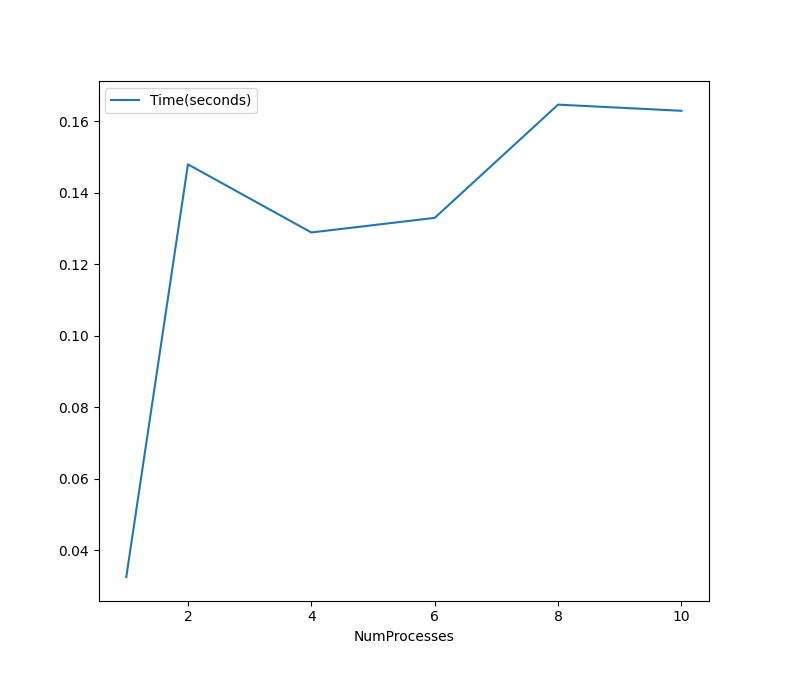
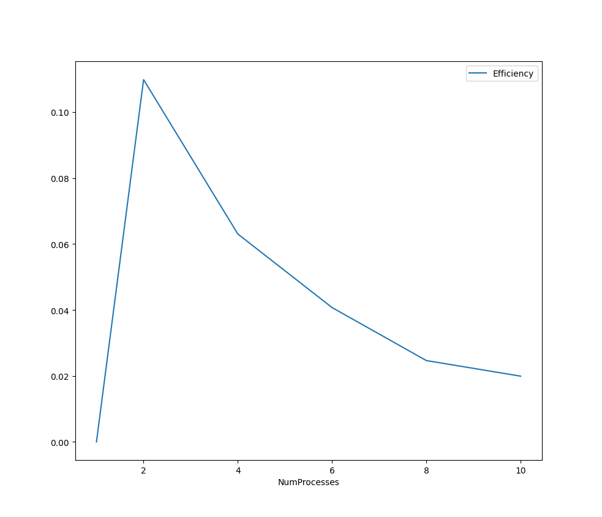

# Вычисление среднего значения элементов вектора

- Student: Кутузов Иван Арсеньевич, group 3823Б1ФИ3
- Technology: SEQ | MPI
- Variant: 2

## 1. Введение

Вычисление среднего значения элементов вектора - типовая задача, которая легко адаптируется к параллельному исполнению. Идеальное ускорение соответствует количеству задействованных процессоров.

## 2. Постановка задачи

### Входные данные:

Дан вектор длины `N`, состоящий из элементов типа `double`.

### Выходные данные:

Значение типа `double`, равное среднему значению всех `N` элементов вектора.

### 3. Последовательный алгоритм

Решение "в лоб": суммируем элементы вектора, затем делим полученную сумму на число элементов в изначальном векторе.

```c++
  GetOutput() = 0.0;

  for (size_t i = 0; i < GetInput().size(); i++) {
    GetOutput() += GetInput()[i];
  }

  GetOutput() /= GetInput().size();
```

### 4. Параллельный алгоритм

Объявлеются две переменные типа `double`:
* `result` - на конец вычислений будет содержать среднее значение элеметов вектора на (всех процессах) - ответ на поставленную задачу;
* `global_sum` - будет содержать значение суммы всех элеметов вектора, частично вычисленное на отдельных процессах и собранное в итогувую сумму на процессе с рангом 0;

```c++
double result = 0.0;
double global_sum = 0.0;
```

Через MPI вызовы получаются значения ранга исполняемого процесса и числа всех процессов;

```c++
int rank = 0;
MPI_Comm_rank(MPI_COMM_WORLD, &rank);

int num_processes = 0;
MPI_Comm_size(MPI_COMM_WORLD, &num_processes);
```

На процессе с рангом 0 определяется количество элементов в векторе. С помощью вызова `MPI_Bcast` это значение рассылается по всем остальным процессам.

```c++
int total_elements_num = 0;
if (rank == 0) {
	total_elements_num = static_cast<int>(GetInput().size());
}
MPI_Bcast(&total_elements_num, 1, MPI_INT, 0, MPI_COMM_WORLD);
```

Определяется размер "пачки" - число элеметов вектора, отдаваемых на обработку каждому процессу. Заметим, что `batch_size * num_processes` может быть меньше числа элеметов в векторе. 

```c++
int batch_size = 0;
batch_size = total_elements_num / num_processes;
```

Если размер "пачки" больше нуля, то:
* Выделяем память под локальный буффер данных, который будет содержать данные, выданные процессу для обработки;
* При помощи вызова `MPI_Scatter` распределяем элементы изначального вектора по процессам поровну (по `batch_size` штук);
* Суммируем данные, лежащие в локальном буфере;
* При помощи вызова `MPI_Reduce` собираем и складываем частичные суммы со всех процессов на процессе с рангом 0 (значение помещается в `global_sum`);
* Здесь же освобождаем память, выделенную под локальный буфер.

```c++
if (batch_size > 0) {
	double *local_buffer = new double[batch_size];
	MPI_Scatter(GetInput().data(), batch_size, MPI_DOUBLE, local_buffer, batch_size, MPI_DOUBLE, 0, MPI_COMM_WORLD);
	
	double sum = 0.0;
	for (int i = 0; i < batch_size; i++) {
	  sum += local_buffer[i];
	}
	
	MPI_Reduce(&sum, &global_sum, 1, MPI_DOUBLE, MPI_SUM, 0, MPI_COMM_WORLD);
	delete[] local_buffer;
}
```

На процессе с рангом ноль обрабатываем элементы, не попавшие в рассылку, просто добавляя их к значению `global_sum`. Затем делим итоговую сумму на число элеметов в изначельном векторе, т.е. получаем ответ задачи - среднее значение элементов вектора. Полученный ответ записываем в `result`.

```c++
if (rank == 0) {
	if (num_processes * batch_size < total_elements_num) {
	  for (int i = num_processes * batch_size; i < total_elements_num; i++) {
		global_sum += GetInput()[i];
	  }
	}

	result = global_sum / static_cast<double>(total_elements_num);
}
```

Рассылаем значение `result` на все остальные процессы (чтобы проходили тесты корректности ответа).

```c++
MPI_Bcast(&result, 1, MPI_DOUBLE, 0, MPI_COMM_WORLD);
GetOutput() = result;
```

Вызываем `MPI_Barrier`, чтобы убедится, что все процессы завершили свою работу.

```c++
MPI_Barrier(MPI_COMM_WORLD);
```

### 5. Среда экспериментов

- Hardware/OS: 14th gen Intel(R) Core(TM) i5-14600KF, 14 ядер (6P+8E ядер), 32 GB RAM, Windows 11 x64
- Toolchain: compiler, version, build type (Release/RelWithDebInfo)
    - Cmake 3.28.3
    - Компилятор: g++ (Ubuntu 13.3.0-6ubuntu2~24.04) 13.3.0
    - Использовался Docker-контейнер.
    - Режим сборки: Release.
- Data: Вектор длиной 50 000 000. 

## 6. Результаты

### 6.1 Корректность

Корректность работы проверена с помощью тестов Google Test на векторах размером: 1, 10, 1000 и 10000.

### 6.2 Производительность

| Mode | Count | Time, s | Speedup | Efficiency |
| ---- | ----- | ------- | ------- | ---------- |
| seq  | 1     | 0.0325  | 1.00    | N/A        |
| mpi  | 2     | 0.1479  | 0.22    | 11.0%      |
| mpi  | 4     | 0.1289  | 0.25    | 6.25%      |
| mpi  | 6     | 0.1329  | 0.24    | 4.0%       |
| mpi  | 8     | 0.1646  | 0.20    | 2.5%       |
| mpi  | 10    | 0.1629  | 0.20    | 2.0%       |

График времени исполнения (в секундах) в зависомости от кол-ва процессов:



График эффективности параллелизма в зависомости от кол-ва процессов:



## 7. Заключение

Операции рассылки данных по процессам и их последующий сбор требуют значительно больше времени, чем решение данной задачи последовательно, что привело к очень низкой эффективности параллелизма.

## 8. Ссылки

1. "Параллельное программирование для кластерных систем" ННГУ им. Лобачевского, ИИТММ