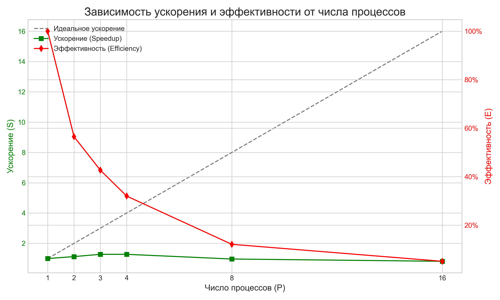

# Параллельная реализация операции Allreduce (Sum) с использованием MPI

- Студент: Маковский Илья Игоревич, группа 3823Б1ФИ2
- Технология: SEQ, MPI
- Вариант: 17

## 1. Введение

Операция "редукции с рассылкой" (Allreduce) является одной из ключевых коллективных операций в параллельных вычислениях. Её суть заключается в сборе данных со всех параллельных процессов, выполнении над ними некоторой операции (например, суммирования, поиска максимума) и последующем распределении итогового результата обратно на все процессы. Цель данной работы — реализовать операцию Allreduce для нахождения суммы элементов целочисленного вектора с использованием технологии MPI, а также сравнить производительность параллельного алгоритма с последовательной реализацией.

## 2. Постановка задачи

Необходимо разработать программную реализацию, которая вычисляет сумму всех элементов заданного на вход вектора `std::vector<int>`. Результат — одно целочисленное значение — должен быть доступен на всех процессах, участвующих в вычислении. Необходимо реализовать две версии: последовательную (для базовых замеров) и параллельную с использованием MPI.

## 3. Базовый алгоритм (Последовательный)

Последовательный алгоритм является тривиальным. Для нахождения суммы всех элементов вектора используется стандартная функция `std::accumulate` из заголовочного файла `<numeric>`. Алгоритм итерируется по всем элементам входного вектора, последовательно прибавляя каждый элемент к внутреннему аккумулятору. Начальное значение аккумулятора равно нулю. Временная сложность такого алгоритма составляет O(N), где N — количество элементов в векторе.

## 4. Схема распараллеливания

Параллельный алгоритм основан на декомпозиции данных и использовании коллективных операций MPI. Схема работы следующая:

1.  **Распределение данных:** Нулевой процесс (root), который изначально владеет всем вектором данных, определяет количество элементов для каждого из `P` процессов. Вектор делится на `P` примерно равных частей. Для распределения этих частей по всем процессам используется коллективная операция `MPI_Scatterv`, которая позволяет рассылать порции данных разного размера, что важно для случаев, когда общее число элементов не делится нацело на число процессов.

2.  **Локальные вычисления:** Каждый из `P` процессов (включая нулевой) получает свою часть вектора и вычисляет локальную сумму элементов. Этот шаг выполняется полностью параллельно и независимо на каждом процессе с использованием `std::accumulate`.

3.  **Глобальная редукция:** После вычисления локальных сумм вызывается коллективная операция `MPI_Allreduce` с оператором `MPI_SUM`. Эта операция собирает локальные суммы со всех процессов, вычисляет их общую (глобальную) сумму и рассылает итоговый результат обратно на все `P` процессов. Таким образом, после завершения `MPI_Allreduce` каждый процесс будет хранить финальный результат.

Такая схема позволяет эффективно распределить вычислительную нагрузку и минимизировать объем пересылаемых данных, так как между процессами передаются только локальные суммы, а не исходные массивы.

## 5. Детали реализации

-   **Структура кода:** Реализация разделена на несколько файлов. `common.hpp` определяет общие типы. `ops_seq.cpp` содержит последовательную реализацию, а `ops_mpi.cpp` — параллельную. Тесты находятся в `tests/functional` и `tests/performance`.
-   **Обработка крайних случаев:** Алгоритм корректно обрабатывает случай с пустым входным вектором, в этом случае итоговая сумма равна нулю.
-   **Использование памяти:** В MPI-реализации каждый процесс хранит только свою часть исходного вектора, что снижает требования к объему оперативной памяти на каждом отдельном узле по сравнению с хранением всего вектора.

## 6. Экспериментальная установка

-   **Оборудование/ОС:**
    -   **CPU:** 13th Gen Intel(R) Core(TM) i7-13700H
    -   **ОС:** Ubuntu 24.04.2 LTS (внутри Docker-контейнера)
-   **Инструментарий:**
    -   **Компилятор:** g++ 14.2.0
    -   **MPI:** Open MPI 4.1.6
    -   **Тип сборки:** `Release`
-   **Окружение:**
    -   `PPC_NUM_PROC` варьировалось от 1 до 16.
-   **Данные:**
    -   Для тестов производительности использовался вектор `std::vector<int>` размером 100,000,000 элементов, каждый из которых был инициализирован значением 1.

## 7. Результаты и обсуждение

### 7.1 Корректность

Корректность работы обеих реализаций была проверена с помощью набора функциональных тестов. Тесты покрывали различные сценарии: векторы с положительными и отрицательными числами, пустой вектор, вектор из одного элемента. Все тесты успешно пройдены, что подтверждает правильность вычислений.

### 7.2 Производительность

Замеры производительности проводились для MPI-реализации на 1, 2, 3, 4, 8 и 16 процессах. За основу для расчетов (`task_run`) взято время выполнения на 1 процессе.

| Число процессов (P) | Время (сек) | Ускорение (S) | Эффективность (E), % |
| :------------------: | :---------: | :-----------: | :------------------: |
|          1           |   0.00786   |     1.00      |         N/A          |
|          2           |   0.00697   |     1.13      |        56.5%         |
|          3           |   0.00616   |     1.28      |        42.7%         |
|          4           |   0.00614   |     1.28      |        32.0%         |
|          8           |   0.00814   |     0.97      |        12.1%         |
|          16          |   0.00956   |     0.82      |         5.1%         |

**Графики производительности:**

*Рис. 1. Зависимость времени выполнения от числа MPI-процессов.*

*Рис. 2. Зависимость ускорения и эффективности от числа MPI-процессов.*

**Анализ:**
Полученные результаты, представленные в таблице и на графиках, очень наглядно демонстрируют влияние накладных расходов на коммуникацию.
-   **Время выполнения (Рис. 1):** График показывает, что минимальное время работы достигается на 3-4 процессах, после чего начинает расти. Это классический признак того, что коммуникационные издержки превысили выгоду от дальнейшего распараллеливания.
-   **Ускорение и Эффективность (Рис. 2):** График ускорения показывает, что максимальное ускорение (~1.28x) далеко от идеального (пунктирная линия). Начиная с 8 процессов, ускорение падает ниже единицы, что означает замедление программы по сравнению с однопроцессным запуском. График эффективности демонстрирует стремительное падение, подтверждая, что каждый дополнительный процесс используется все менее и менее продуктивно.

Причиной такого поведения является то, что сама по себе задача (сумма элементов) является очень "легкой" и быстровыполнимой для современного процессора. В результате время, которое система тратит на организацию взаимодействия между процессами (запуск, рассылка данных `MPI_Scatterv`, сбор и рассылка результата `MPI_Allreduce`), оказывается значительно больше, чем выигрыш от параллельного выполнения сложения.

## 8. Выводы

В ходе работы была успешно реализована и протестирована параллельная версия алгоритма нахождения суммы элементов вектора с использованием технологии MPI. Экспериментальные результаты показали, что для данной конкретной задачи распараллеливание не всегда приводит к ускорению. Из-за крайне низкой вычислительной сложности задачи накладные расходы на MPI-коммуникации начинают доминировать над временем полезных вычислений уже при небольшом количестве процессов (8 и более), что приводит к замедлению. Данная работа служит отличной иллюстрацией закона Амдала и важности оценки соотношения времени вычислений и времени коммуникаций при проектировании параллельных алгоритмов.

## 9. Источники

1.  MPI_Allreduce documentation - [https://www.open-mpi.org/doc/v4.1/man3/MPI_Allreduce.3.php](https://www.open-mpi.org/doc/v4.1/man3/MPI_Allreduce.3.php)
2.  std::accumulate documentation - [https://en.cppreference.com/w/cpp/algorithm/accumulate](https://en.cppreference.com/w/cpp/algorithm/accumulate)