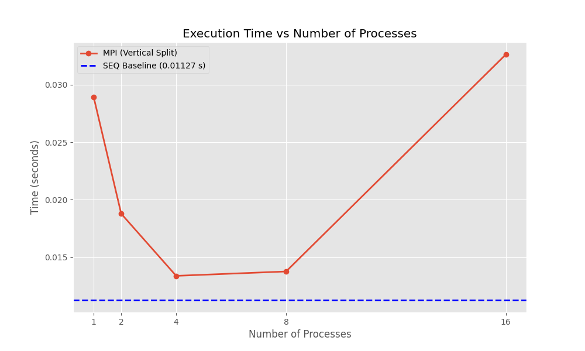
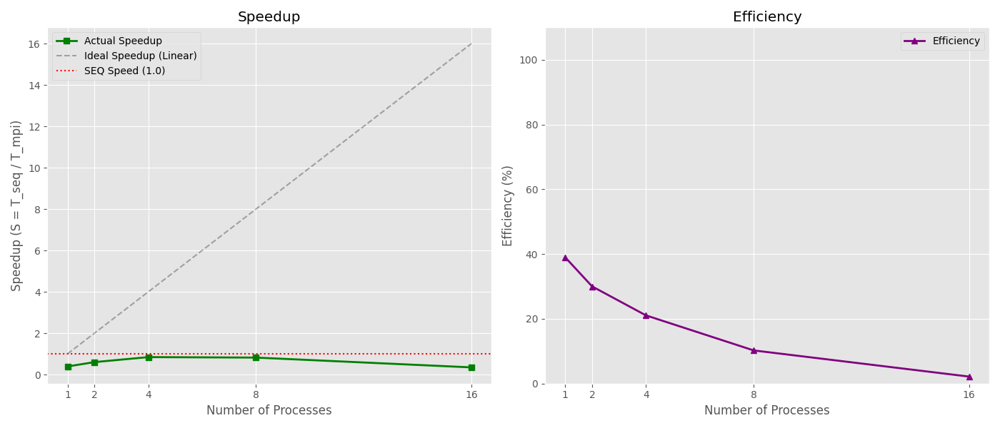

# Параллельная реализация вертикального фильтра Гаусса с использованием MPI

- Студент: Маковский Илья Игоревич, группа 3823Б1ФИ2
- Технология: SEQ, MPI
- Вариант: 27

## 1. Введение

Фильтрация изображений — одна из фундаментальных задач компьютерного зрения и обработки сигналов. Фильтр Гаусса широко используется для размытия изображения и удаления шума. Поскольку обработка изображений высокого разрешения требует значительных вычислительных ресурсов, распараллеливание этого процесса является актуальной задачей. Цель данной работы — реализовать блочный алгоритм фильтрации Гаусса с использованием технологии MPI при условии вертикального разбиения области данных и сравнить его производительность с последовательной версией.

## 2. Постановка задачи

На вход подается изображение, представленное в виде линеаризованного вектора целочисленных значений пикселей (`std::vector<int>`), а также его ширина и высота. Необходимо применить к каждому пикселю изображения свертку с ядром Гаусса размером 3x3.

**Ограничения и условия:**
1.  Ядро свертки:
    ```
    1 2 1
    2 4 2
    1 2 1
    ```
    Сумма коэффициентов равна 16.
2.  Граничные условия: Значения за пределами изображения берутся равными значению ближайшего граничного пикселя (clamping).
3.  Разбиение данных: **Вертикальное** (изображение режется на вертикальные полосы).

## 3. Базовый алгоритм (Последовательный)

Последовательный алгоритм (`GaussFilterSEQ`) реализует проход скользящим окном 3x3 по всему изображению.
Алгоритм:
1.  Создается выходной буфер того же размера.
2.  Происходит итерация по строкам и столбцам изображения.
3.  Для каждого пикселя `(row, col)` вычисляется взвешенная сумма соседей с использованием ядра.
4.  Для доступа к соседям используется вспомогательная функция `GetPixel`, реализующая логику граничных условий (clamp).
5.  Полученная сумма делится на 16 и записывается в выходной буфер.

Временная сложность алгоритма — $O(W \times H)$, где $W, H$ — размеры изображения.

## 4. Схема распараллеливания

Используется геометрическая декомпозиция данных (Data Parallelism) с вертикальным разбиением.

1.  **Распределение данных (Scatter):**
    Изображение хранится в памяти построчно (row-major order). При вертикальном разбиении данные, относящиеся к одной полосе, **не лежат** в памяти непрерывно.
    *   Процесс-root вычисляет ширину полосы для каждого процесса.
    *   Так как стандартный `MPI_Scatter` работает с непрерывными блоками, данные предварительно упаковываются вручную: из каждой строки изображения копируется сегмент, соответствующий полосе процесса, в непрерывный буфер отправки.
    *   Используется `MPI_Send` (для worker-ов) и прямое копирование (для root).

2.  **Обмен граничными данными (Halo Exchange):**
    Для обработки пикселей на границах полосы необходимы данные из соседних полос (столбец слева и столбец справа).
    *   Каждый процесс определяет своих соседей (rank-1 и rank+1).
    *   Происходит обмен граничными столбцами ("призрачными" ячейками) с помощью неблокирующих операций `MPI_Isend` и `MPI_Irecv`, чтобы избежать взаимных блокировок.

3.  **Локальные вычисления:**
    Каждый процесс применяет фильтр Гаусса к своей локальной полосе. Для внутренних пикселей используются локальные данные, для краевых — полученные "призрачные" ячейки.

4.  **Сбор данных (Gather):**
    Аналогично рассылке, сборка требует ручной распаковки.
    *   Worker-процессы отправляют свои обработанные полосы на Root.
    *   Root принимает полосы и копирует их в результирующее изображение, восстанавливая правильный порядок строк и столбцов.

## 5. Детали реализации

-   **Файловая структура:**
    -   `common/include/common.hpp`: Общие типы и функция `GetPixel`.
    -   `seq/src/ops_seq.cpp`: Последовательная реализация.
    -   `mpi/src/ops_mpi.cpp`: MPI реализация класса `GaussFilterMPI`.
-   **Ключевые моменты:**
    -   Для корректной работы с произвольным числом процессов ширина полос вычисляется динамически (базовая ширина + остаток распределяется по первым процессам).
    -   Используется `MPI_Allgather` для того, чтобы каждый процесс знал ширину полос соседей (необходимо для корректного обмена границами).

## 6. Экспериментальная установка

-   **Оборудование/ОС:**
    -   **CPU:** 13th Gen Intel(R) Core(TM) i7-13700H (14 ядер, 20 потоков)
    -   **RAM:** 8 GB (выделено в Docker)
    -   **ОС:** Ubuntu 24.04.2 LTS (запуск внутри Docker-контейнера)
-   **Инструментарий:**
    -   **Компилятор:** g++ 14.2.0
    -   **MPI:** Open MPI 4.1.6
    -   **Система сборки:** CMake (конфигурация `-D CMAKE_BUILD_TYPE=Release`)
    -   **Библиотеки:** Google Test, Google Benchmark
-   **Окружение:**
    -   Число процессов (`PPC_NUM_PROC`) варьировалось от 1 до 16.
    -   Запуск производился через `scripts/run_tests.py` с типом `performance`.
-   **Данные:**
    -   Входные данные генерируются процедурно в `tests/performance/main.cpp`.
    -   Объект тестирования: Изображение (матрица, линеаризованная в вектор) размером **2000x2000** пикселей.
    -   Тип данных: `int` (значения пикселей от 0 до 255).
    -   Общий объем обрабатываемых данных: ~4 миллиона элементов (около 16 МБ).

## 7. Результаты и обсуждение

### 7.1 Корректность

Корректность реализации подтверждена функциональными тестами (`tests/functional`), которые сравнивают выходные данные MPI-версии с эталонной последовательной версией на малых изображениях. Также тесты производительности проверяют соответствие размеров выходных данных ожидаемым.

### 7.2 Производительность

Ниже приведены результаты замеров времени выполнения (среднее время `task_run` из Google Benchmark) на изображении 2000x2000.

| Режим | Процессов (P) | Время (с) | Ускорение (S) | Эффективность (E) |
|:-----:|:-------------:|:---------:|:-------------:|:-----------------:|
|  SEQ  |       1       |  0.01127  |     1.00      |        N/A        |
|  MPI  |       1       |  0.02890  |     0.39      |        39%        |
|  MPI  |       2       |  0.01878  |     0.60      |        30%        |
|  MPI  |       4       |  0.01338  |     0.84      |        21%        |
|  MPI  |       8       |  0.01376  |     0.82      |        10%        |
|  MPI  |      16       |  0.03263  |     0.35      |        2%         |

**Время выполнения:**
На графике ниже видно сравнение времени работы MPI версии с эталонным последовательным временем (синяя пунктирная линия).


*Рис. 1. Зависимость времени выполнения от числа процессов.*

**Ускорение и эффективность:**


*Рис. 2. Ускорение и эффективность параллельного алгоритма.*

**Анализ результатов:**

1.  **Накладные расходы (Overhead):**
    Как видно из Рис. 1, MPI-реализация даже на 1 процессе работает значительно медленнее последовательной (0.0289с против 0.0113с). Это обусловлено необходимостью упаковки данных: при вертикальном разбиении данные полос не лежат в памяти последовательно, что требует копирования каждой строки изображения в буферы отправки.

2.  **Поведение кривой времени:**
    График времени имеет форму "галочки". Время уменьшается при переходе от 1 к 4 процессам (достигая минимума 0.01338с), но затем начинает расти. Это точка, где выигрыш от параллелизма перекрывается накладными расходами на коммуникацию и синхронизацию.

3.  **Отсутствие реального ускорения:**
    Как показано на Рис. 2 (график слева), кривая ускорения (Actual Speedup) находится ниже красной линии (1.0). Это означает, что параллельная версия не смогла обогнать оптимизированную последовательную версию на данном размере задачи.
    Причины:
    *   **Малый объем вычислений:** Свертка 3x3 — очень легкая операция.
    *   **Сложная коммуникация:** Вертикальное разбиение требует больших накладных расходов на работу с памятью и пересылку "призрачных" зон.

4.  **Резкое падение эффективности:**
    Эффективность (Рис. 2, справа) стремительно падает с увеличением числа процессов, опускаясь до 2% на 16 процессах. Это подтверждает, что данная задача (на размере 2000x2000) плохо масштабируется при выбранной схеме разбиения данных.

## 8. Выводы

В ходе работы был реализован параллельный алгоритм фильтрации Гаусса. Эксперименты показали, что для задачи с **вертикальным разбиением** данных, хранящихся построчно, и при относительно малом объеме вычислений на пиксель, накладные расходы на управление памятью (упаковка/распаковка) и коммуникацию MPI доминируют над вычислениями.

Параллельная версия не дала ускорения по сравнению с оптимизированной последовательной версией на данных размером 2000x2000. Для достижения эффективности MPI в данной задаче требуется либо значительно больший размер изображения, либо использование горизонтального разбиения, которое позволяет передавать данные непрерывными блоками памяти без лишнего копирования.

## 9. Источники

1.  Parallel Programming Course - [https://learning-process.github.io/parallel_programming_course/ru/](https://learning-process.github.io/parallel_programming_course/ru/)
2.  Parallel Programming 2025-2026 Video-Records - [https://disk.yandex.ru/d/NvHFyhOJCQU65w](https://disk.yandex.ru/d/NvHFyhOJCQU65w)
3.  Open MPI: Documentation — [https://www.open-mpi.org/doc/](https://www.open-mpi.org/doc/)
4.  C++ reference (cppreference.com) — [https://en.cppreference.com/w/cpp/algorithm/ranges/min_element](https://en.cppreference.com/w/cpp/algorithm/ranges/min_element)
5.  Алгоритм фильтра Гаусса: [https://ru.wikipedia.org/wiki/Размытие_по_Гауссу](https://ru.wikipedia.org/wiki/Размытие_по_Гауссу)
6.  Фильтр Гаусса на стероидах: секреты ускорения вычислений: [https://habr.com/ru/companies/smartengines/articles/877082](https://habr.com/ru/companies/smartengines/articles/877082)