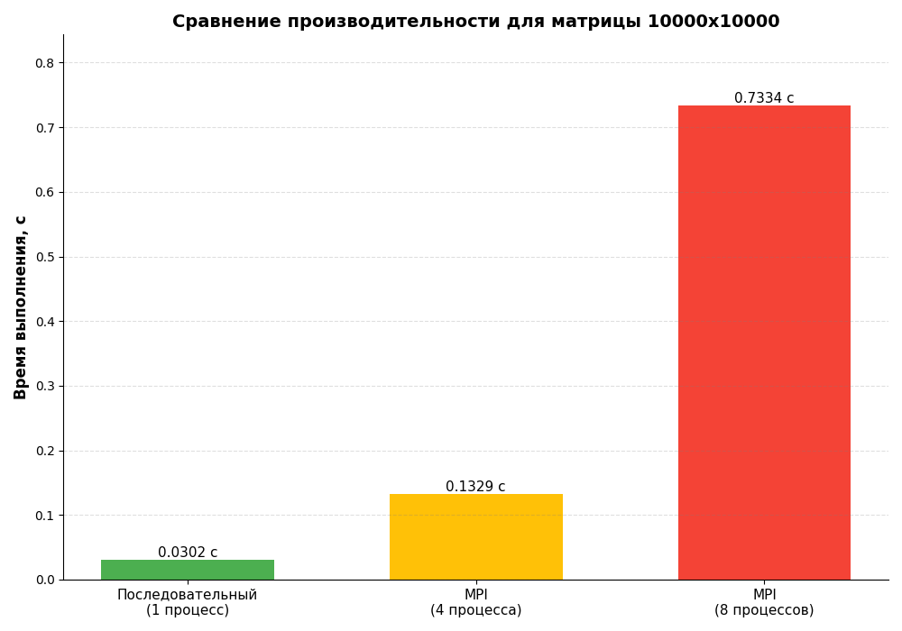

# Поиск минимального значения в каждой строке матрицы

- Студент: Маковский Илья Игоревич, группа 3823Б1ФИ2
- Технология: SEQ, MPI
- Вариант: 17

## 1. Введение

Обработка больших объемов данных, представленных в виде матриц, является фундаментальной задачей во многих областях, включая научные вычисления, машинное обучение и обработку изображений. Одной из базовых операций является агрегация данных, например, поиск минимального или максимального значения. При работе с матрицами большого размера последовательное выполнение таких операций может занимать значительное время.

Целью данной работы является разработка и анализ параллельной реализации алгоритма поиска минимального элемента в каждой строке матрицы с использованием технологии MPI (Message Passing Interface), а также сравнение её производительности с последовательной версией на задачах разного масштаба.

## 2. Постановка задачи

**Дано:** матрица целых чисел размера M x N.

**Требуется:** получить вектор L длиной M, в котором каждый элемент `L[i]` является минимальным значением в `i`-й строке исходной матрицы.

**Входные данные:** `std::vector<std::vector<int>>` — двумерный вектор целых чисел.
**Выходные данные:** `std::vector<int>` — вектор минимальных значений.

**Ограничения:** Матрица и её строки могут быть непустыми. Реализация должна корректно обрабатывать случаи, когда количество строк не делится нацело на количество используемых процессов.

## 3. Базовый алгоритм (Последовательный)

Последовательный алгоритм является интуитивно понятным и реализуется с помощью итерации по строкам.

1.  Создаётся выходной вектор `result` размером M (по количеству строк во входной матрице).
2.  Выполняется итерация по каждой строке матрицы от `i = 0` до `M-1`.
3.  Для каждой `i`-й строки находится минимальный элемент. В данной реализации для этого используется стандартная функция `std::ranges::min_element`, которая эффективно находит наименьшее значение в диапазоне.
4.  Найденное минимальное значение сохраняется в `result[i]`.

Алгоритм имеет временную сложность O(M * N), так как требует полного обхода всех элементов матрицы.

## 4. Схема распараллеливания

Для распараллеливания алгоритма была выбрана технология MPI и схема "Мастер-Рабочий" (Master-Worker).

-   **Декомпозиция данных:** Задача декомпозируется по данным. Строки исходной матрицы равномерно распределяются между всеми доступными MPI-процессами.
-   **Роли процессов:**
    -   **Процесс с рангом 0 (Мастер):**
        1.  Владеет полной матрицей.
        2.  Вычисляет, сколько строк должен обработать каждый процесс. Учитывает случай, когда общее число строк не делится нацело на число процессов, распределяя "остаток" по одному на первые процессы.
        3.  Обрабатывает свою часть строк локально.
        4.  Рассылает остальным процессам (Рабочим) их порции строк с помощью блокирующих отправок `MPI_Send`.
        5.  После завершения вычислений всеми процессами, собирает частичные результаты (векторы минимальных значений) от всех, включая себя, с помощью `MPI_Gatherv`. Использование `Gatherv` необходимо, так как размеры порций у процессов могут незначительно отличаться.
    -   **Процессы с рангом > 0 (Рабочие):**
        1.  Получают от Мастера информацию о количестве строк, которые им нужно обработать (`MPI_Recv`).
        2.  В цикле получают данные каждой строки (`MPI_Recv`).
        3.  Локально вычисляют минимальные значения для полученных строк.
        4.  Отправляют свой вектор с результатами Мастеру в рамках коллективной операции `MPI_Gatherv`.

-   **Коммуникационная схема:** Используется комбинация сообщений точка-точка (`MPI_Send`/`MPI_Recv`) для распределения задач и коллективная операция (`MPI_Gatherv`) для сбора результатов. Это классический паттерн Scatter-Gather, реализованный вручную для гибкости.

## 5. Экспериментальная установка

-   **Окружение:**
    -   **CPU:** 13th Gen Intel(R) Core(TM) i7-13700H (20 логических ядер)
    -   **RAM:** 8 GB (выделено для Docker-контейнера)
    -   **OS:** Ubuntu 24.04.2 LTS (внутри Docker-контейнера)
-   **Инструментарий:**
    -   **Компилятор:** GCC 14.2.0 (g++)
    -   **MPI:** Open MPI 4.1.6
    -   **Тип сборки:** `Release`
-   **Параметры запуска:**
    -   Тесты производительности запускались для последовательной реализации и для MPI-реализации с числом процессов 4 и 8.
    -   Для тестов использовались случайно сгенерированные квадратные матрицы размерами 100x100, 1000x1000, 5000x5000 и 10000x10000.

## 6. Результаты и обсуждение

### 6.1 Корректность

Корректность работы реализованных алгоритмов проверялась с помощью набора функциональных gtest-тестов. Тесты покрывают различные случаи, включая:
-   Матрицы стандартного размера.
-   Матрицы с отрицательными числами.
-   Матрицы, состоящие из одной строки или одного столбца.

Параллельная реализация на всех тестах выдавала идентичные результаты с последовательной, что подтверждает её корректность.

### 6.2 Производительность

Для оценки производительности измерялось чистое время выполнения алгоритма (`task_run`). На основе полученных данных были рассчитаны метрики ускорения (Speedup) и эффективности (Efficiency).

-   **Ускорение (S):** `S(p) = T(1) / T(p)`, где `T(1)` — время выполнения последовательной версии, а `T(p)` — время на `p` процессах.
-   **Эффективность (E):** `E(p) = S(p) / p * 100%`.

**Таблица 1. Результаты для матрицы 100x100**

| Режим | Число процессов | Время, с | Ускорение | Эффективность |
| :---- | :--------------: | :------: | :-------: | :-----------: |
| seq   |        1         | 0.000001 |   1.00    |      N/A      |
| mpi   |        4         | 0.000042 |   ~0.03   |     ~0.8%     |

**Таблица 2. Результаты для матрицы 1000x1000**

| Режим | Число процессов | Время, с | Ускорение | Эффективность |
| :---- | :--------------: | :------: | :-------: | :-----------: |
| seq   |        1         | 0.000224 |   1.00    |      N/A      |
| mpi   |        4         | 0.001155 |   ~0.19   |     ~4.8%     |

**Таблица 3. Результаты для матрицы 5000x5000**

| Режим | Число процессов | Время, с | Ускорение | Эффективность |
| :---- | :--------------: | :------: | :-------: | :-----------: |
| seq   |        1         | 0.007760 |   1.00    |      N/A      |
| mpi   |        4         | 0.024518 |   ~0.32   |     ~8.0%     |

**Таблица 4. Результаты для матрицы 10000x10000**

| Режим | Число процессов | Время, с | Ускорение | Эффективность |
| :---- | :--------------: | :------: | :-------: | :-----------: |
| seq   |        1         | 0.030222 |   1.00    |      N/A      |
| mpi   |        4         | 0.132926 |   ~0.23   |     ~5.7%     |
| mpi   |        8         | 0.733439 |   ~0.04   |     ~0.5%     |

**Результат будет выглядеть примерно так:**

**Анализ результатов:**

Полученные результаты являются аномальными и демонстрируют **замедление** вместо ускорения при использовании MPI. Ускорение (Speedup) меньше единицы на всех тестах. Эффективность крайне низка.

Возможные причины такого поведения:
1.  **Накладные расходы MPI:** Для задач малого и среднего размера, которые выполняются очень быстро (в данном случае, за сотые и тысячные доли секунды), время, затрачиваемое на запуск MPI-процессов, установление коммуникаций, передачу данных (`MPI_Send`) и их сбор (`MPI_Gatherv`), многократно превышает время полезных вычислений.
2.  **Высокопроизводительная последовательная версия:** Использование `std::ranges::min_element` в последовательной версии является очень эффективной операцией, которая, вероятно, хорошо векторизуется компилятором.
3.  **Издержки на сериализацию/десериализацию:** Пересылка данных между процессами требует их упаковки и распаковки, что добавляет задержки.
4.  **"Шум" измерений:** На очень малых интервалах времени (менее миллисекунды) точность измерений может страдать, однако общая тенденция к замедлению очевидна.

Интересно отметить, что при увеличении числа процессов с 4 до 8 на самой большой задаче (10000x10000) время выполнения катастрофически выросло. Это указывает на то, что коммуникационные издержки стали доминирующим фактором, полностью "съев" выгоду от распараллеливания вычислений.

## 8. Выводы

В ходе работы были реализованы последовательный и параллельный (MPI) алгоритмы. Функциональное тестирование подтвердило их корректность.

Однако, эксперименты с производительностью показали, что для данной конкретной задачи — поиска минимума в строке — параллелизация с помощью MPI на протестированных размерах данных является неэффективной. Накладные расходы на коммуникацию между процессами значительно превышают выигрыш от параллельных вычислений.

Данный результат демонстрирует важный принцип параллельного программирования: не всякая задача получает выигрыш от распараллеливания. Эффективность сильно зависит от соотношения времени вычислений ко времени коммуникаций (computation-to-communication ratio). Для данной задачи это соотношение оказалось слишком низким. Чтобы MPI-реализация стала эффективной, необходимо либо значительно увеличить объем вычислений на каждую строку, либо использовать матрицу на порядки большего размера.

## 9. Источники

1.  Parallel Programming Course - [https://learning-process.github.io/parallel_programming_course/ru/](https://learning-process.github.io/parallel_programming_course/ru/)
2.  Parallel Programming 2025-2026 Video-Records - [https://disk.yandex.ru/d/NvHFyhOJCQU65w](https://disk.yandex.ru/d/NvHFyhOJCQU65w)
3.  Open MPI: Documentation — [https://www.open-mpi.org/doc/](https://www.open-mpi.org/doc/)
4.  C++ reference (cppreference.com) — [https://en.cppreference.com/w/cpp/algorithm/ranges/min_element](https://en.cppreference.com/w/cpp/algorithm/ranges/min_element)
